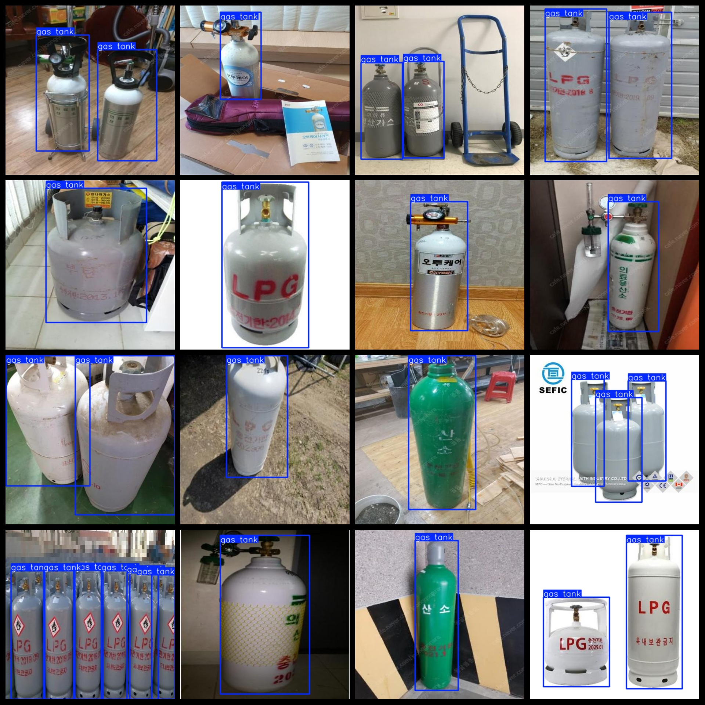

# Gas bottle 5-litre Detection Dataset 1117 imagesVOC+YOLO format

Gas Tank Detection Dataset 1117 sheets VOC + YOLO format

Dataset format: Pascal VOC format + YOLO format (the txt file does not contain the split path, it only contains jpg images and corresponding VOC format xml files and yolo format txt files)

Number of jpg files: 1117

Number of xml files: 1117

Number of txt files: 1117

Number of categories: 1

The Github repository is: datasets_sl

Annotation class names: ["gas tank"]

Number of boxes labeled in each category:

Gas tank frame count = 2044

Total frame count: 2044

Number of images per category:

Gas tank ownership images = 1117

Image resolution: 416x416

Use the labeling tool: labelImg

Dataset Augmentation: No

Rules for annotation: Draw a rectangle around the category.

Important note: The dataset does not have been divided into training, validation, and testing sets.

Special Disclaimer: This dataset does not guarantee the accuracy of the trained models or weight files.

Annotation and image details are as follows:

## Images

---

Here is a pay link on Stripe (https://buy.stripe.com/3cs8yP7sY87d0vu9AB). Please contact me lonlonago@foxmail.com after funding $89, and I will send you a complete data files, thank you!

